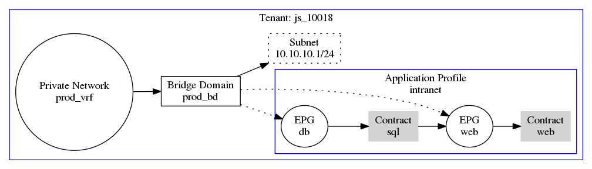
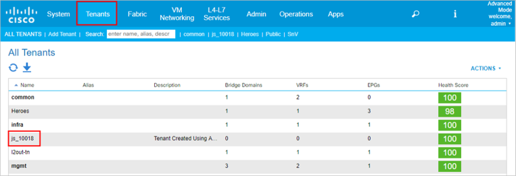
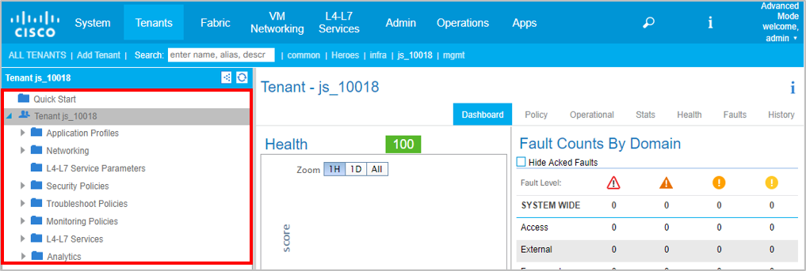

## Getting Started with the ACI Tenant Modules

The ACI Tenant Modules support a wide range of ACI Tenant configurations, however, we introduce the core modules needed for managing Tenant Networks, Policies, and EPGs. 

This lab covers each of the module's purpose, unique parameters, and expected output. At the end of this module, you will create and use a playbook that ensures a Tenant configuration exists. The below ACI Toolkit diagram is the configuration that this Ansible playbook will configure and ensure exists.



This lab is using the following inventory file that comes with the repository cloned at the beginning of this lab:

```
[apic:vars]
username=admin
password=ciscopsdt

[apic]
sandboxapicdc.cisco.com

```

You should note that `[apic:vars]` denotes group variables for the group called `apic`. In the group `apic`, there is just a single host called **sandboxapicdc.cisco.com** that is a publicly resolvable DNS name.


### Using the Tenant Module

The `aci_tenant` module is used to manage Tenant's on the APIC. This module has only one unique parameter that you need to be aware of:

* `tenant`: This is the name of the Tenant that you would like to manage or retrieve configurations from the APIC for.

> Note: Since the Tenant is the root parent for all Tenant related objects, the `tenant` parameter will be used in all of the other Tenant modules.

Open the `01_aci_tenant_pb.yml` file within `REPLACEME` directory you cloned previously from GitHub at the beginning of this lab. The first and only play in this playbook is used to ensure the necessary configurations exist on the APIC for an application. 

The task in this play will be executed against all hosts in group called `apic`--which as we said, is a single APIC: **sandboxapicdc.cisco.com**

This is the playbook you'll see when you open the file:

```yaml
---
- name: ENSURE APPLICATION CONFIGURATION EXISTS
  hosts: apic
  connection: local
  gather_facts: False

  vars_prompt:
    - name: "tenant"
      prompt: "What would you like to name your Tenant?"
      private: no

  tasks:
    - name: ENSURE APPLICATIONS TENANT EXISTS
      aci_tenant:
        host: "{{ inventory_hostname }}"
        username: "{{ username }}"
        password: "{{ password }}"
        state: "present"
        validate_certs: False
        tenant: "{{ tenant }}"
        description: "Tenant Created Using Ansible"
```

The first task is named "ENSURE APPLICATION'S TENANT EXISTS" and uses the `aci_tenant` module. Most of the parameters are for connecting to the APIC, but `tenant` and `description` are used for performing an actual configuration.  Remember the module is idempotent, so it'll only make a change if the tenant doesn't exist _or_ the tenant exists, but has a different description configured.

The `description` has been statically defined as "Tenant Created Using Ansible", but the Tenant's name will use a variable, that you'll enter interactively when you execute the playbook.  In order to do this, we're  leveraging an Ansible play attribute called `vars_prompt`.

Let's run the playbook!

### Executing the Playbook and Creating a Tenant

Now return to the directory, `REPLACEME`, that has all of the files you cloned.  Make sure you are in the directory containing the `01_aci_tenant_pb.yml`.

**When the playbook  prompts you for the Tenant's name, use your initials and zip code to form the name. For example, John Smith who lives in zip code 10018, would create the tenant name js_10118, as also shown below:**

When you are in the correct directory, execute the playbook: 


```bash
$ ansible-playbook 01_aci_tenant_pb.yml -i inventory
What would you like to name your Tenant?: js_10018 
PLAY [ENSURE APPLICATION CONFIGURATION EXISTS] ***************************************************************************************

TASK [ENSURE APPLICATIONS TENANT EXISTS] ********************************************************************************************
changed: [apic1]

PLAY RECAP ***************************************************************************************************************************
apic1                      : ok=1    changed=1    unreachable=0    failed=0   
$ 
```

This should be a unique tenant (assuming no one else with your initials that lives in your Zip code is currently on this APIC!!!) , so you should have results of **ok=1** and **changed=1**.

You can also check the APIC to validate your new Tenant existS:
* Click on Tenants
* Double-Click on your Tenant to open it



When you open your Tenant, you will see its children on the left-hand navbar; you can use these to validate your playbooks work as expected throughout this lab. We will guide you through validating the Tenant Network modules, and you can continue to check the APIC GUI as you wish after each task for change verification.


