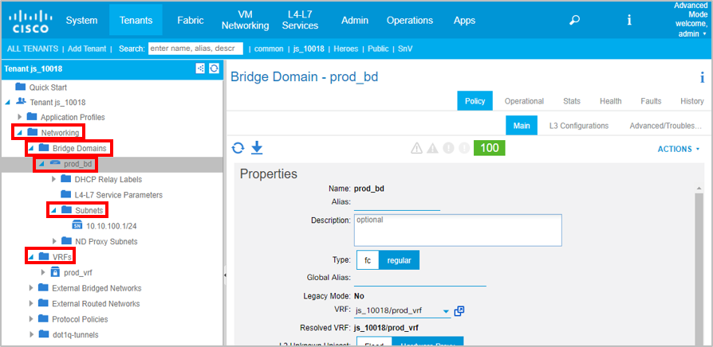

## Tenant Network Modules

There are a few modules related to Tenant networking constructs, but we will focus on the three necessary for providing an Application with network connectivity:

* `aci_vrf`
* `aci_bd`
* `aci_bd_subnet`

We will discuss each of these modules, and then use Ansible to execute all three tasks to ensure the proper network objects exist.

### VRF Module

The `aci_vrf` module is used to manage Tenant VRFs on the APIC. This module has three key parameters to be aware of:

* **vrf:** The name to give the new VRF or Context.
* **policy_control_preference:** Determines whether or not the VRF will enforce Security Policies
* **policy_control_direction:** Determines if the policies will be enforced at ingress or egress from the switches.

Open the `02_aci_tenant_network_pb.yml` file, and look at the first task:

```yaml
  tasks:
    - name: ENSURE TENANT VRF EXISTS
      aci_vrf:
        host: "{{ inventory_hostname }}"
        username: "{{ username }}"
        password: "{{ password }}"
        state: "present"
        validate_certs: False
        tenant: "{{ tenant }}"
        vrf: "{{ vrf }}"
        description: "VRF Created Using Ansible"
```

This task does not include the the *policy_control* parameters, since we just want to use the default values supplied by the APIC. Also, this task uses a variable for `vrf`, which we will show you how to use Ansible's extra-vars feature to supply the variable to the playbook (at playbook runtime). The benefit of this approach is that the playbook can be re-used without having to manually edit the file every time we want to use a different VRF.

In the next task, we'll look at adding an associated bridge domain.

### Bridge Domain Module

The `aci_bd` module is used to manage Bridge Domains. This module has several parameters; here are the more important ones:

* `bd:` The name of the Bridge Domain.
* `vrf:` The VRF which Subnets associated to the Bridge Domain should belong to. 
* `scope:` Determines whether the Subnet should be considered public (advertised externally), private(only available to the VRF), or shared (used between multiple VRFs).

It is import to point out that the default value for `scope` is **private**. If you would like the network to be reachable outside of the VRF or the ACI fabric, then you will need to build your playbooks to explicitly set the scope to **public**.

Look back at the `02_aci_tenant_network_pb.yml` file, and examine the second task:

```yaml
    - name: ENSURE TENANT BRIDGE DOMAIN EXISTS
      aci_bd:
        host: "{{ inventory_hostname }}"
        username: "{{ username }}"
        password: "{{ password }}"
        validate_certs: False
        state: "present"
        tenant: "{{ tenant }}"
        bd: "{{ bd | default('prod_bd') }}"
        vrf: "{{ vrf }}"
        description: "BD Created Using Ansible"
```

This task is using the same `vrf` variable as the previous task, which is important since we want to make sure we are working with the same VRF in both tasks.

There is also a new variable introduced for the `bd` parameter, which also provides a default when the `bd` variable does not exist. Providing default variable values is useful when you want to use the same value the majority of the times the playbook is executed, but occasionally you would like override that default value.

### Subnet Module
The `aci_bd_subnet` module is used to manage Subnets that belong to a Bridge Domain. Since Subnets are a child object of a Bridge Domain, the `bd` parameter is also used in this module. Here are the more common paramters:

* `gateway:` The gateway address for hosts on the Subnet.
* `subnet_mask:` The subnet mask associated with the Subnet.
* `scope:` Determines if the Subnet should be advertised externally (public), kept private to the VRF (private), or shared with other Tenants (shared).

This module also supports `subnet_name`, but this is not the root key used by the APIC to identify a Subnet object.

```yaml
    - name: ENSURE TENANT SUBNET EXISTS
      aci_bd_subnet:
        host: "{{ inventory_hostname }}"
        username: "{{ username }}"
        password: "{{ password }}"
        validate_certs: False
        state: "present"
        tenant: "{{ tenant }}"
        bd: "{{ bd | default('prod_bd')}}"
        gateway: "10.1.100.1"
        mask: 24
        scope: "public"
        description: "Subnet Created Using Ansible"
```

## Executing the Playbook and Adding a VRF, Bridge Domain, and Subnet

Now that you are familiar with the Tenant Networking modules, it is time to execute the playbook. Since you just created the Tenant, running the playbook will create a new VRF, Bridge Domain, and Subnet for this Tenant. 

Ansible allows you to pass variables to the playbook through the command shell using the `--extra-vars` flag (or `-e` for short hand syntax). The format is `--extra-vars "var1=value1 var2=value2"` where `var1` and `var2` are variables used in the playbook and **value1** and **value2** are their desired values for this execution. For our playbook, we will use `"vrf=prod_vrf"` and let the `bd` variable use the default of `prod_db`.

Follow along in your command shell to execute the Tenant Networking Playbook:

> Make sure to use the same Tenant name you used for the previous playbook!!

```bash
$ ansible-playbook 02_aci_tenant_network_pb.yml -i inventory --extra-vars "vrf=prod_vrf"
What would you like to name your Tenant?: js_10018

PLAY [ENSURE APPLICATION CONFIGURATION EXISTS] ***************************************************************************************

TASK [ENSURE TENANT VRF EXISTS] ******************************************************************************************************
changed: [apic1]

TASK [ENSURE TENANT BRIDGE DOMAIN EXISTS] ********************************************************************************************
changed: [apic1]

PLAY RECAP ***************************************************************************************************************************
apic1                      : ok=2    changed=2    unreachable=0    failed=0   

$ 
```

Navigate back to your Tenant in the APIC GUI, and follow these steps to validate the Networks exist:

* Expand the "Networking" folder
* Expand the "Bridge Domains" folder to see the prod_db bridge domain you created.
* Expand the "prod_db" folder 
* Expand the "Subnets" folder to view the subnet you created
* Expand the "VRFs" folder to view the VRF you created


