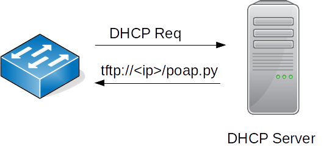
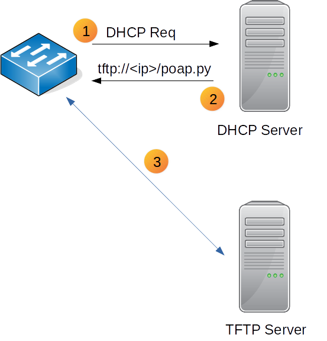
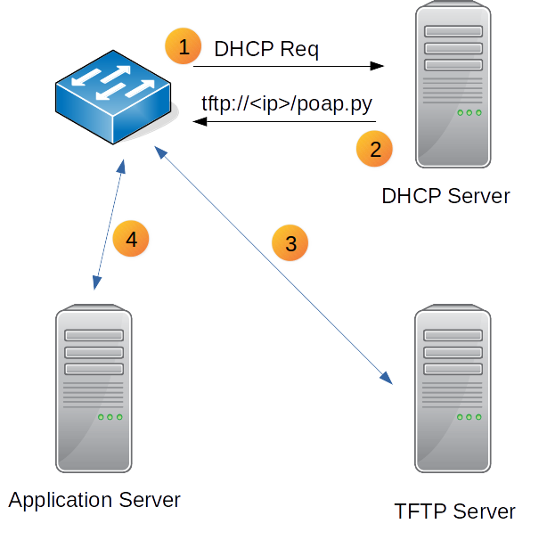

Never Console into your Nexus Switches Again using POAP

If you were to tell your cloud or server admin friends that in this day and age you have to manually configure every switch as you un-box and deploy them, you'll probably get expressions that range from sympathy to disdain. 

Thankfully, you don't have to put up with that when you're using Cisco Nexus switches--in fact, there has been a feature that helps with boostrapping devices on NX-OS for years. It's just not that widely known.  We plan to change that!  This particular feature, Power On Auto Provisioning (POAP), is available on all Cisco Nexus switches and empowers datacenter network engineers to  provision brand new switches automatically without ever using a console cable anymore!

### Power On Auto Provisioning - Enabling zero touch provisioning for data center switches.

With POAP, the brand new switch boots for the first time (or with an empty startup config), get's an IP address via DHCP, figures out the appropriate OS/image needed to meet requirements, downloads this image, downloads the desired configuration, reboots and comes up with the desired configuration and image.  Sound pretty cool?  It should be because the switch comes up ready and configured to production standards - all this without any human logging in to the device!

Let's explore the technology and a sample workflow that makes this magic happen.

### Kicking off things with DHCP

One of the first things a brand new switch on boot does, is make a DHCP request. The DHCP server receives the request and based on the source mac address, assigns the device an IP address. In addition to assigning an IP address to the device, the DHCP server's response contains the name of a Python(or TCL) script in option 150/66 along with the IP address of a TFTP server to download the script from.

### Passing the baton from DHCP

The switch now reaches out to the TFTP server and downloads the Python file from the TFTP server and executes it. 

Note that you as the operator have full control of building the script and making sure it has the logic you desire.  A sample implementation could be as follows:

- The script executes some basic device identification commands locally (such as show commands collecting the MAC or Serial Number of the device).
- It then sends this information in a HTTP request to an internal application server.

- The application server then uses this identifier receives in the HTTP POST, to generate specific configuration for the requesting device (possibly using the Python Jinja2 library to render the configurations).
- The application server also provides the the image/OS version information expected to be running on the device.
- The name of the rendered configuration file, the expected system image and the server/protocol details to download the image and rendered configuration are passed back to the switch.

### Download and install

The POAP script that initiated on the switch receives OS, configuration file details and download instructions from the application server in the prior step. It first checks if the image currently running on the device matches the image instructed by the application server. If there is a difference, the switch uses the download instructions provided by the response, to connect to and download the desired image from the file server. 
Then, the switch downloads the desired configuration and copies it to the startup config of the device.

### Reload and we're done!

At this point the switch has downloaded the desired image and configuration. It then reboots into the new image. The desired configuration loads into running from the startup. With no human intervention (other than switching it on), the switch has automatically been provisioned with the correct image and the desired configuration. So next time you run into your cloud admin friend, hold your head high! Zero touch provisioning...pffft... of course our network can do it.

About the Author

Ajay Chenempara is a senior network automation engineer at [Network to Code](http://networktocode.com), a network automation solutions provider that provides network automation training and professional services.  Ajay is the lead instructor at Network to Code while also assisting with automation related projects.  He's usually in front of customers helping them learn different tools, APIs, and technologies ranging from Python and Ansible to more complex CI/CD pipelines and how they can be leveraged within the context of network automation.  Ajay can be reached at ajay@networktocode.com.

