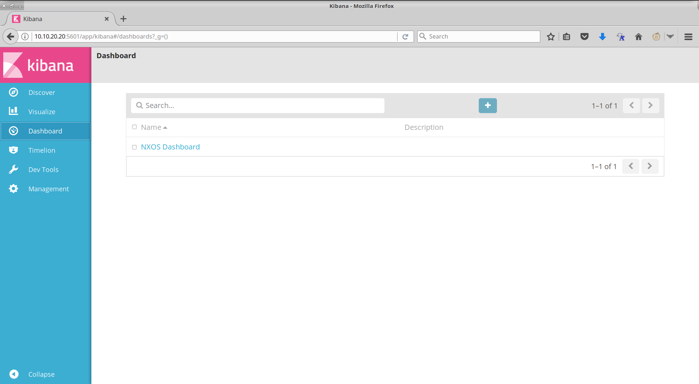
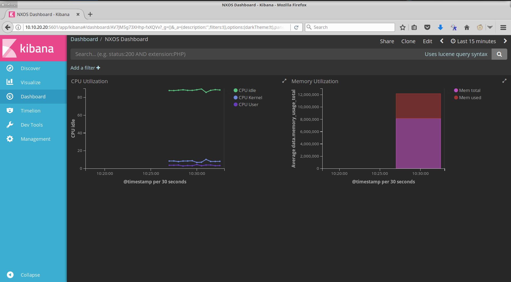

# Get Started with Streaming Telemetry on Open NX-OS - Part 3

In parts 1 and 2 we learned how to configure streaming telemetry on NX-OS using _show commands_ and the _DME_, or Data Modeling Engine. In this section, we will learn how to consume the data and visualize it, using a big data analysis platform like **ElasticSearch** (formerly known as the ELK Stack). We will collect the CPU and memory utilization data from Open NX-OS devices and visualize it within the **Kibana** dashboard.
If you are not familiar with the ELK or Elastic Stack, don't worry. We will be covering a high level overview of the components and how they are used for analyzing the data.

## Preparing the switches:

**STOP:** You should ensure that the NXOS Sandbox lab is reserved before starting as it takes a few minutes to get started!


# Ensure that Dependencies are Configured

If you are working on this lab directly after completing Part 2, you may skip this section. If not, please install the Python `flask` library on the devbox as follows:

Log into the devbox and perform the following:

```shell

(python2) [root@localhost telemetry]# pip install -r requirements.txt

Collecting flask
  Downloading Flask-0.12.2-py2.py3-none-any.whl (83kB)
    100% |████████████████████████████████| 92kB 827kB/s 
Collecting itsdangerous>=0.21 (from flask)
  Downloading itsdangerous-0.24.tar.gz (46kB)
    100% |████████████████████████████████| 51kB 2.2MB/s 
Collecting click>=2.0 (from flask)
  Downloading click-6.7-py2.py3-none-any.whl (71kB)
    100% |████████████████████████████████| 71kB 1.9MB/s 
Collecting Werkzeug>=0.7 (from flask)
  Downloading Werkzeug-0.12.2-py2.py3-none-any.whl (312kB)
    100% |████████████████████████████████| 317kB 1.5MB/s 
Requirement already satisfied: Jinja2>=2.4 in /root/sbx_nxos/venv/python2/lib/python2.7/site-packages (from flask)
Requirement already satisfied: MarkupSafe in /root/sbx_nxos/venv/python2/lib/python2.7/site-packages (from Jinja2>=2.4->flask)
Building wheels for collected packages: itsdangerous
  Running setup.py bdist_wheel for itsdangerous ... done
  Stored in directory: /root/.cache/pip/wheels/fc/a8/66/24d655233c757e178d45dea2de22a04c6d92766abfb741129a
Successfully built itsdangerous
Installing collected packages: itsdangerous, click, Werkzeug, flask
Successfully installed Werkzeug-0.12.2 click-6.7 flask-0.12.2 itsdangerous-0.24
(python2) [root@localhost telemetry]#
```

Now fire up the `simple_collector.py` app used in Part 1, as follows:

``` shell
(python2) [root@localhost telemetry]# python simple_collector.py 
 * Running on http://0.0.0.0:8888/ (Press CTRL+C to quit)
 * Restarting with stat
 * Debugger is active!
 * Debugger PIN: 171-300-662

```
As you can see the app is listening on port `8888` and will be used as the destination listener for our telemetry configuration.


## Monitoring the system resources 

In order to understand the collection process, we will focus on monitoring just the CPU and memory utilization of a single device using the `show system resources` command. 

### Configuring the switch for streaming telemetry

In a new terminal, we will now configure telemetry on `nx-osv9000-1`. Similar to the telemetry lab instructions in Part 1, configure:
- A sensor that issues the `show system resources` command.
- The destination, as our devnet box, where we started our `simple_collector.py` in the earlier step.
- The subscription that ties the sensor to the destination and set the sample interval to 30s.

``` shell
nx-osv9000-1# configure terminal 
Enter configuration commands, one per line. End with CNTL/Z.
nx-osv9000-1(config)# telemetry
nx-osv9000-1(config-telemetry)#   destination-group 101
nx-osv9000-1(conf-tm-dest)#     ip address 10.10.20.20 port 8888 protocol HTTP encoding JSON 
nx-osv9000-1(conf-tm-dest)#   sensor-group 101
nx-osv9000-1(conf-tm-sensor)#     data-source NX-API
nx-osv9000-1(conf-tm-sensor)#     path "show system resources" depth 0 
nx-osv9000-1(conf-tm-sensor)#   subscription 101
nx-osv9000-1(conf-tm-sub)#     dst-grp 101
nx-osv9000-1(conf-tm-sub)#     snsr-grp 101 sample-interval 30000
nx-osv9000-1(conf-tm-sub)# 

```

You can check the terminal where `simple_collector.py` was started.  You'll now see requests and the data coming from the switch at 30s intervals.

### Logging the telemetry data

Open the `simple_collector.py` app using a text editor. 

``` python
from flask import Flask, request

# Initialize the Flask application
app = Flask(__name__)

@app.route('/<path:path>', methods = ['POST'])
def collect(path):
    try:
        fh = open ('/tmp/nxos.log', 'a')
        fh.write(request.data)
	print(request.data)
        fh.write("\n\n")
    except KeyboardInterrupt:
        fh.close()
    return ''


# Entry Point to the Application
if __name__ == '__main__':
    with open('/tmp/nxos.log', 'w') as fh:
        fh.write("Initializing log....\n\n")
        
    app.run(host='0.0.0.0', port=8888,  debug=True)

```

Observe that the app is writing the incoming data to a file - `/tmp/nxos.log`. Use the unix `tail` command to view the contents in real time:

``` shell
(python2) [root@localhost telemetry]# 
(python2) [root@localhost telemetry]# tail -f /tmp/nxos.log 
{ "version_str": "1.0.0", "node_id_str": "nx-osv9000-1", "encoding_path": "show system resources", "collection_id": 263, "collection_start_time": 0, "collection_end_time": 0, "msg_timestamp": 0, "subscription_id": [ ], "sensor_group_id": [ ], "data_source": "NX-API", "data": { "load_avg_1min": "0.69", "load_avg_5min": "0.64", "load_avg_15min": "0.55", "processes_total": "556", "processes_running": "1", "cpu_state_user": "4.00", "cpu_state_kernel": "8.53", "cpu_state_idle": "87.46", "TABLE_cpu_usage": { "ROW_cpu_usage": [ { "cpuid": "0", "user": "1.09", "kernel": "7.69", "idle": "91.20" }, { "cpuid": "1", "user": "4.34", "kernel": "20.65", "idle": "75.00" }, { "cpuid": "2", "user": "1.02", "kernel": "1.02", "idle": "97.95" }, { "cpuid": "3", "user": "10.41", "kernel": "5.20", "idle": "84.37" } ] }, "memory_usage_total": "8163776", "memory_usage_used": "4030780", "memory_usage_free": "4132996", "current_memory_status": "OK" } }

{ "version_str": "1.0.0", "node_id_str": "nx-osv9000-1", "encoding_path": "show system resources", "collection_id": 264, "collection_start_time": 0, "collection_end_time": 0, "msg_timestamp": 0, "subscription_id": [ ], "sensor_group_id": [ ], "data_source": "NX-API", "data": { "load_avg_1min": "0.81", "load_avg_5min": "0.68", "load_avg_15min": "0.56", "processes_total": "558", "processes_running": "2", "cpu_state_user": "4.82", "cpu_state_kernel": "10.18", "cpu_state_idle": "84.98", "TABLE_cpu_usage": { "ROW_cpu_usage": [ { "cpuid": "0", "user": "1.04", "kernel": "5.20", "idle": "93.75" }, { "cpuid": "1", "user": "13.26", "kernel": "8.16", "idle": "78.57" }, { "cpuid": "2", "user": "2.29", "kernel": "18.39", "idle": "79.31" }, { "cpuid": "3", "user": "2.17", "kernel": "9.78", "idle": "88.04" } ] }, "memory_usage_total": "8163776", "memory_usage_used": "4031168", "memory_usage_free": "4132608", "current_memory_status": "OK" } }


```

The contents of this log file will be the input to the Elastic Stack.  

### Overview of the Elastic Stack application suite

The Elastic Stack is an open source, big data application suite that consists of multiple applications. For our purposes, we will focus on only 3 of them, namely:
- Elasticsearch
- Logstash
- Kibana

[**Elasticsearch**](https://www.elastic.co/products/elasticsearch) is a storage and search engine that is very versatile. It is highly regarded for it's scaling ability and makes intelligent assumptions of the data it stores - which makes it a fantastically smart tool while searching for the data.

[**Logstash**](https://www.elastic.co/products/logstash) is a data processing pipeline that ingests logs in multiple formats (across multiple sources potentially), transforms it and sends it to a storage/analytics engine - In this lab, we use Elasticsearch as the *stash*

[**Kibana**](https://www.elastic.co/products/kibana) is a visualizing tool. It lets you build graphs and dashboards based on the data stored (and analyzed) in Elasticsearch


### Deploying a Pre-Configured Elastic Stack

On a terminal in the devbox, navigate to the `elk` folder.

```shell
(python2) [root@localhost telemetry]# cd /root/sbx_nxos/learning_labs/telemetry/elk/
(python2) [root@localhost elk]# ls
elk_backup.yml  elk_dashboard.yml  elk.yml  files  hosts
(python2) [root@localhost elk]# 

```

Within that directory, there is an Ansible playbook called `elk_dashboard.yml`. This playbook will install the necessary software components, configure the stack and start the services for us.

Now, go ahead and run the playbook:

``` shell
(python2) [root@localhost elk]# ansible-playbook -i hosts elk_dashboard.yml 

PLAY [INSTALL THE ELK STACK FOR DEVNET] ****************************************

TASK [ENSURE THAT SOFTWARE IS UNINSTALLED] *************************************
skipping: [10.10.20.20] => (item=[]) 

TASK [ENSURE THAT ELK DIRECTORIES ARE REMOVED] *********************************
skipping: [10.10.20.20] => (item=/etc/elasticsearch) 
skipping: [10.10.20.20] => (item=/etc/kibana) 
skipping: [10.10.20.20] => (item=/etc/logstash) 
skipping: [10.10.20.20] => (item=/etc/yum.repos.d/elasticsearch-5.x.repo) 
skipping: [10.10.20.20] => (item=/etc/yum.repos.d/logstash.repo) 
skipping: [10.10.20.20] => (item=/var/lib/logstash) 
skipping: [10.10.20.20] => (item=/var/lib/elasticsearch) 
skipping: [10.10.20.20] => (item=/var/lib/kibana) 

TASK [ENSURE THAT JAVA IS INSTALLED] *******************************************
changed: [10.10.20.20]

TASK [ENSURE THAT THE REPO FILES ARE PRESENT] **********************************
changed: [10.10.20.20] => (item=elasticsearch-5.x.repo)
changed: [10.10.20.20] => (item=logstash.repo)

TASK [ENSURE THAT THE ELK STACK IS INSTALLED] **********************************
changed: [10.10.20.20] => (item=[u'elasticsearch', u'logstash', u'kibana'])

TASK [UPDATE ELASTICSEARCH TO LISTEN ON ALL INTFS] *****************************
changed: [10.10.20.20]

TASK [ELASTICSEARCH REPO PATH] *************************************************
changed: [10.10.20.20]

TASK [UPDATE KIBANA TO LISTEN ON ALL INTFS] ************************************
changed: [10.10.20.20]

TASK [ENSURE THAT THE TEMPLATE FILE IS PRESENT] ********************************
changed: [10.10.20.20]

TASK [ENSURE THAT THE LOGSTASH CONFIG IS UPDATED] ******************************
changed: [10.10.20.20]

RUNNING HANDLER [restart services] *********************************************
changed: [10.10.20.20] => (item=elasticsearch)
changed: [10.10.20.20] => (item=logstash)
changed: [10.10.20.20] => (item=kibana)

PLAY [RESTORE THE BACKED UP ELK SETTINGS] **************************************

TASK [UNTAR THE BACKUP] ********************************************************
changed: [10.10.20.20]

TASK [ENSURE THAT ELASTICSEARCH IS UP] *****************************************
ok: [10.10.20.20]

TASK [INITIALIZE THE LOGICAL REPO] *********************************************
ok: [10.10.20.20]

TASK [RESTORE THE BACKUP] ******************************************************
ok: [10.10.20.20]

TASK [OPEN THE INDICES] ********************************************************
ok: [10.10.20.20] => (item=.kibana)
ok: [10.10.20.20] => (item=nxos_index)

PLAY RECAP *********************************************************************
10.10.20.20                : ok=14   changed=10   unreachable=0    failed=0   

```
The main configuration file we add is the `/etc/logstash/conf.d/nxos_log.conf`. Open this file in a text editor to understand how Logstash is consuming data from our log file (`/tmp/nxos.log`) and transforming it for Elasticsearch.

``` shell
input {
 file {
     path => "/tmp/nxos.log"
     start_position => "beginning"
     type => "nxos_type"
    }
}

filter {
   json {
     source => message
     }
   }
output {
elasticsearch {
   hosts => "localhost"
   index => "nxos_index"
   document_type => "nxos_type"
   template => "/tmp/nxos_template.json"
   }
}
```

The *input* section instructs Logstash to use the `/tmp/nxos.log` file as the source. The *output* section instructs Logstash to output the data to Elasticsearch, running on the localhost and to store the logs within an index called `nxos_index`.

We use a template (in /root/sbx_nxos/learning_labs/telemetry/elk/files) called `nxos_template.json` to define the mapping for correctly typecasting the telemetry data returned for the `show system resources` command.

> Note: You will need to customize the template for every command you want to collect data for.


At this point a fully installed and configured Elastic Stack is available for us to work with and visualize our data.  

Now, open a browser window on your laptop and point it to `http://10.10.20.20:5601`. This is the URL and listener port for the Kibana app that we just installed on the devbox. You will hit the landing page that will display the telemetry data that was fed to Elasticsearch. 


Feel free to explore the links on this page.  On the search bar you can try out some search criteria that follows the [`lucene query syntax`](https://lucene.apache.org/core/2_9_4/queryparsersyntax.html#Overview)

You can also click on the `Available Fields` to narrow down any data point you are interested in.

## Visualizing the data collected

When we ran the Ansible playbook earlier, it created a dashboard for us that charts out the CPU and memory utilization metrics.

Click on "Dashboard" on the left panel of the webpage.



This takes you the dashboards that are currently configured on Elastic Stack. Go ahead and click on the `NXOS Dashboard`.



> Note that the configuration for visualizing this dashboard was previously created. The configuration was applied when we ran the playbook earlier.


You can click on individual graphs and observe the CPU and memory utilization data coming in from `nx-osv9000-1`.

Thus, in this lab, you configured an Open NX-OS switch to monitor CPU and memory utilization using the `show system resources` command. You then configured the device to stream this data over HTTP using JSON encoding to the `simple_collecter.py` app.  The app also then prepared the data into a file for consumption into the Elastic Stack, in which you were able to visualize the data streamed by the switch.
