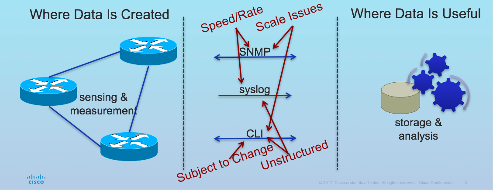
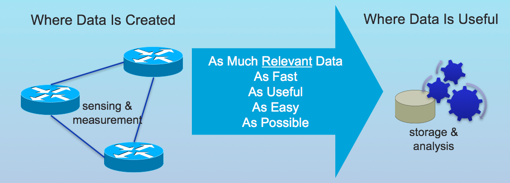

# Get Started with Streaming Telemetry on Open NX-OS

Network equipment monitoring has traditionally relied on SNMP. And whenever SNMP MIBs did not exist for a certain monitoring criteria, network engineers have had to  resort to _screen scraping the CLI_ by parsing show commands and config files.

One of the biggest drawbacks with either of these methods is that both of these imply a central polling server that periodically makes SNMP queries (or repeatedly connects via telnet/SSH).  In other words, these methods _pull_ data from the device.  The pull model does not scale when there is more than one network management station (NMS) in the network. With this type of model, the network device sends data only when the NMS (or server) requests it. To initiate such requests, continual manual intervention is required. This continual manual intervention makes the pull model inefficient while also enhancing visibility in your environment.



Cisco's Open NX-OS devices support a push model, which continuously streams data from the network device to a server configured to receive _the stream of data_.  This is what's often referred to as _streaming telemetry_.  Streaming telemetry enables the push model, which provides near real-time access to monitoring data (based on how often the devices push data), and streams it to what is called a collector.




The NX-OS telemetry feature supports two ways in which the device can stream, or push, monitored data to the collector:

  - Using the NX-OS Data Modeling Engine (DME) defined models
  - Using the NX-API CLI
 
The DME is an information-model-based architecture in which the model describes all the information that can be monitored (and controlled) by a management process. Object instances are referred to as managed objects (MOs). Every managed object in the system can be identified by a unique distinguished name (DN). This model is fully [documented](https://developer.cisco.com/media/dme/index.html) An example to help illustrate this would be `sys/intf` a data model [representation](https://developer.cisco.com/media/dme/index.html) of the device's interface. The attributes of this model can be used to configure or monitor it. 

> Note: the concept of MOs and DNs within Open NX-OS is the same exact concept as used in the Cisco ACI platform.

On the other hand, NX-API CLI can collect and stream switch information using show commands.

However, using the NX-API instead of streaming data from the DME has inherent scale limitations due to how NX-API consumes internal Linux processes. 

## Pre-requisites

- Familiarity with Linux file navigation & package installation
- Familiarity with JSON

## Objectives

- Learn how to install and upgrade/downgrade the telemetry software component on Nexus switches
- Learn how to configure telemetry for streaming show command output using NX-API
- Learn how to collect and perform basic visualization of the data collected

## Preparing the Switches

**STOP:** You should ensure that the NXOS Sandbox lab is reserved before starting as it takes a few minutes to get started!


## Installation and Upgrade

The telemetry application is packaged as a feature RPM and included with the NX-OS release. The RPM is installed by default as part of the image bootup. For incremental updates and fixes, the process is as follows:

1. Copy the RPM to the bootflash of the device using SCP/TFTP.

2. Drop down to the bash mode on the switch:

``` shell
nx-osv9000-1# feature bash
nx-osv9000-1# run bash sudo su
bash-4.2#
```

3. Upgrade to the newer version of the RPM

``` shell
bash-4.2# yum upgrade <telemetry_new_version>.rpm
```

4. If there is a need to downgrade to an earlier version, this is done as follows:

``` shell
bash-4.2# yum downgrade telemetry
```

Let's now take a look at how to perform the initial configuration for streaming telemetry on Open NX-OS based switches.

## Configuring Open NX-OS for Streaming Telemetry

Ensure you're back at the CLI prompt of the switch.

### A Basic Configuration 

The first step in configuring telemetry is to enable the feature called `telemetry`.

Log into switch `nx-osv9000-1` and enter the following commands:

``` shell
nx-osv9000-1# configure terminal 
Enter configuration commands, one per line. End with CNTL/Z.
nx-osv9000-1(config)# feature telemetry 
nx-osv9000-1(config)# 
```

The telemetry specific configuration is done under the `telemetry configuration mode`. 

Now enter the command `telemetry` to go into this configuration mode.

``` shell
nx-osv9000-1(config)# 
nx-osv9000-1(config)# telemetry
nx-osv9000-1(config-telemetry)# 
```


At a high level, the the telemetry configuration entails the following:

1. Creating a set of sensors for the items we are interested in monitoring
2. Creating a set of destinations - identifying the collectors to send the telemetry data to.
3. Associating the sensors and destinations together, as a subscription. 

### Creating a Sensor

Let us build this out for collecting the system resources on the switch.

Start by configuring the sensor information, while in the telemetry configuration mode, enter the following commands on **nx-osv9000-1**.

``` shell
nx-osv9000-1(config)# telemetry
nx-osv9000-1(config-telemetry)# sensor-group 100
nx-osv9000-1(conf-tm-sensor)# data-source NX-API
nx-osv9000-1(conf-tm-sensor)# path "show system resources" 
nx-osv9000-1(conf-tm-sensor)# 

```


Here, we are creating a sensor group identified by the number `100`. Within this we define the data source to be `NX-API`. As noted in the introduction, the telemetry data on the devices are gleaned either through the DME (using  modeled data) or the NX-API (using show commands). While any NX-API show commands, that support JSON output can be used, for configuring the sensors, it is highly recommended to only use show commands if that telemetry data cannot be gleaned from the DME, due to processing overheads of using a show command. 

> Note: You can identify whether a particular show command supports JSON output by `piping` the output of the show command to json on the nxos command line. 

``` shell
nx-osv9000-1# show system resources | json
{"load_avg_1min": "1.50", "load_avg_5min": "1.35", "load_avg_15min": "1.12", "processes_total": "596", "processes_running": "5", "cpu_state_user": "5.05", "cpu_state_kernel": "10.11", "cpu_s
tate_idle": "84.83", "TABLE_cpu_usage": {"ROW_cpu_usage": [{"cpuid": "0", "user": "4.16", "kernel": "7.29", "idle": "88.54"}, {"cpuid": "1", "user": "7.40", "kernel": "11.11", "idle": "81.48
"}]}, "memory_usage_total": "8165260", "memory_usage_used": "5946888", "memory_usage_free": "2218372", "current_memory_status": "OK"}
nx-osv9000-1# 

```


For our first sensor, we are going to collect the data from the output of `show system resources`. Thus, the command is specified as a `path` within the sensor-group.

> A sensor group can contain more than one sensors that belong to the same data source type. This could be a collection of show commands, for example.

### Specify your Target Destination

The next step is configure the collector information. Enter the following commands into the switch.

``` shell
nx-osv9000-1(conf-tm-sensor)# destination-group 100
nx-osv9000-1(conf-tm-dest)# ip address 10.10.20.20 port 8888 protocol HTTP encoding JSON 
nx-osv9000-1(conf-tm-dest)# 

```

NX-OS telemetry supports sending of the sensor data either over HTTP, or [gRPC](https://grpc.io/), a high performance RPC framework from Google. While using the NX-OS telemetry feature, higher data throughput (anything that's greater than 4MB) is supported only over gRPC. The encoding format while using gRPC is GPB or gRPC protocol buffers. This will be covered in future DevNet labs.

In the configuration above, however, we are using the HTTP protocol (that supports JSON encoding).  You can think of this as basically making a HTTP POST to the destination collector. We configured a destination group - once again identified by the number `100`. Within this destination group we identified a single IP address and port.

> A destination group can contain more than one destination and destination protocol/encoding types.


Now, the sensor group(s) and destination groups(s) are associated using a `subscription`. On **nx-osv9000-1**, create a subscription identified by the number `100`.

``` shell
nx-osv9000-1(conf-tm-dest)# 
nx-osv9000-1(conf-tm-dest)# subscription 100
nx-osv9000-1(conf-tm-sub)# snsr-grp 100 sample-interval 10000
nx-osv9000-1(conf-tm-sub)# dst-grp 100
nx-osv9000-1(conf-tm-sub)# 
```

The subscription now ties the sensor group 100 to the destination group 100. The sample interval determines how often the sensor group is polled by the device in milliseconds - every 10 seconds in our configuration. 

> Setting the sample-interval to `0`, will result in the sensor being triggered only when the state of the sensors change (when using the DME) - typically UP/DOWN notifications or criteria that typically stay constant for most part, like number of BGP neighbors or received routes.

### Verify the Telemetry Configuration

View a summary of the switch's telemetry configuration by issuing the following command:

``` shell
nx-osv9000-1# show running-config telemetry 

!Command: show running-config telemetry
!Time: Mon Aug 28 16:05:25 2017

version 7.0(3)I6(1)
feature telemetry

telemetry
  destination-group 100
    ip address 10.10.20.20 port 8888 protocol HTTP encoding JSON 
  sensor-group 100
    data-source NX-API
    path "show system resources" depth 0 
  subscription 100
    dst-grp 100
    snsr-grp 100 sample-interval 10000

```


## Using a Telemetry Collector

With this telemetry configuration in place, log into the devbox and navigate to the telemetry directory:

``` shell
(python2) [root@localhost sbx_nxos]# cd /root/sbx_nxos/learning_labs/telemetry/
(python2) [root@localhost telemetry]# 

```

Here, we will run a basic HTTP listener (listening on port 8888, per our collector destination configuration above) and observe the streaming telemetry information being sent.

First, install the Python `flask` library need by the listener:

``` shell

(python2) [root@localhost telemetry]# pip install -r requirements.txt

Collecting flask
  Downloading Flask-0.12.2-py2.py3-none-any.whl (83kB)
    100% |████████████████████████████████| 92kB 827kB/s 
Collecting itsdangerous>=0.21 (from flask)
  Downloading itsdangerous-0.24.tar.gz (46kB)
    100% |████████████████████████████████| 51kB 2.2MB/s 
Collecting click>=2.0 (from flask)
  Downloading click-6.7-py2.py3-none-any.whl (71kB)
    100% |████████████████████████████████| 71kB 1.9MB/s 
Collecting Werkzeug>=0.7 (from flask)
  Downloading Werkzeug-0.12.2-py2.py3-none-any.whl (312kB)
    100% |████████████████████████████████| 317kB 1.5MB/s 
Requirement already satisfied: Jinja2>=2.4 in /root/sbx_nxos/venv/python2/lib/python2.7/site-packages (from flask)
Requirement already satisfied: MarkupSafe in /root/sbx_nxos/venv/python2/lib/python2.7/site-packages (from Jinja2>=2.4->flask)
Building wheels for collected packages: itsdangerous
  Running setup.py bdist_wheel for itsdangerous ... done
  Stored in directory: /root/.cache/pip/wheels/fc/a8/66/24d655233c757e178d45dea2de22a04c6d92766abfb741129a
Successfully built itsdangerous
Installing collected packages: itsdangerous, click, Werkzeug, flask
Successfully installed Werkzeug-0.12.2 click-6.7 flask-0.12.2 itsdangerous-0.24

```

Now fire up the app as follows:

``` shell
(python2) [root@localhost telemetry]# python simple_collector.py 
 * Running on http://0.0.0.0:8888/ (Press CTRL+C to quit)
 * Restarting with stat
 * Debugger is active!
 * Debugger PIN: 171-300-662

```

As you can see, the app is listening on port `8888` and you should start seeing the requests coming in from the switch - at 10 second intervals.

``` shell
(python2) [root@localhost telemetry]# python simple_collector.py 
 * Running on http://0.0.0.0:8888/ (Press CTRL+C to quit)
 * Restarting with stat
 * Debugger is active!
 * Debugger PIN: 171-300-662
172.16.30.101 - - [28/Aug/2017 17:06:26] "POST /network/show%20system%20resources HTTP/1.0" 200 -
{ "version_str": "1.0.0", "node_id_str": "nx-osv9000-1", "encoding_path": "show system resources", "collection_id": 19, "collection_start_time": 0, "collection_end_time": 0, "msg_timestamp": 0, "subscription_id": [ ], "sensor_group_id": [ ], "data_source": "NX-API", "data": { "load_avg_1min": "0.50", "load_avg_5min": "0.50", "load_avg_15min": "0.50", "processes_total": "568", "processes_running": "2", "cpu_state_user": "3.74", "cpu_state_kernel": "8.82", "cpu_state_idle": "87.43", "TABLE_cpu_usage": { "ROW_cpu_usage": [ { "cpuid": "0", "user": "1.03", "kernel": "8.24", "idle": "90.72" }, { "cpuid": "1", "user": "11.00", "kernel": "4.00", "idle": "85.00" }, { "cpuid": "2", "user": "1.09", "kernel": "4.39", "idle": "94.50" }, { "cpuid": "3", "user": "1.13", "kernel": "20.45", "idle": "78.40" } ] }, "memory_usage_total": "8163776", "memory_usage_used": "4020320", "memory_usage_free": "4143456", "current_memory_status": "OK" } }
172.16.30.101 - - [28/Aug/2017 17:06:36] "POST /network/show%20system%20resources HTTP/1.0" 200 -

```

The app writes the collected data to a local file called `/tmp/nxos.log`. `tail` this file in a separate terminal window, to observe the 10s updates being streamed from the switch to the collector.

``` shell
(python2) [root@localhost telemetry]# 
(python2) [root@localhost telemetry]# 
(python2) [root@localhost telemetry]# tail -f /tmp/nxos.log 
{ "version_str": "1.0.0", "node_id_str": "nx-osv9000-1", "encoding_path": "show system resources", "collection_id": 19, "collection_start_time": 0, "collection_end_time": 0, "msg_timestamp": 0, "subscription_id": [ ], "sensor_group_id": [ ], "data_source": "NX-API", "data": { "load_avg_1min": "0.50", "load_avg_5min": "0.50", "load_avg_15min": "0.50", "processes_total": "568", "processes_running": "2", "cpu_state_user": "3.74", "cpu_state_kernel": "8.82", "cpu_state_idle": "87.43", "TABLE_cpu_usage": { "ROW_cpu_usage": [ { "cpuid": "0", "user": "1.03", "kernel": "8.24", "idle": "90.72" }, { "cpuid": "1", "user": "11.00", "kernel": "4.00", "idle": "85.00" }, { "cpuid": "2", "user": "1.09", "kernel": "4.39", "idle": "94.50" }, { "cpuid": "3", "user": "1.13", "kernel": "20.45", "idle": "78.40" } ] }, "memory_usage_total": "8163776", "memory_usage_used": "4020320", "memory_usage_free": "4143456", "current_memory_status": "OK" } }

{ "version_str": "1.0.0", "node_id_str": "nx-osv9000-1", "encoding_path": "show system resources", "collection_id": 20, "collection_start_time": 0, "collection_end_time": 0, "msg_timestamp": 0, "subscription_id": [ ], "sensor_group_id": [ ], "data_source": "NX-API", "data": { "load_avg_1min": "0.43", "load_avg_5min": "0.47", "load_avg_15min": "0.50", "processes_total": "568", "processes_running": "2", "cpu_state_user": "3.44", "cpu_state_kernel": "9.01", "cpu_state_idle": "87.53", "TABLE_cpu_usage": { "ROW_cpu_usage": [ { "cpuid": "0", "user": "2.27", "kernel": "18.18", "idle": "79.54" }, { "cpuid": "1", "user": "0.00", "kernel": "6.38", "idle": "93.61" }, { "cpuid": "2", "user": "1.05", "kernel": "5.26", "idle": "93.68" }, { "cpuid": "3", "user": "10.20", "kernel": "4.08", "idle": "85.71" } ] }, "memory_usage_total": "8163776", "memory_usage_used": "4020444", "memory_usage_free": "4143332", "current_memory_status": "OK" } }

{ "version_str": "1.0.0", "node_id_str": "nx-osv9000-1", "encoding_path": "show system resources", "collection_id": 21, "collection_start_time": 0, "collection_end_time": 0, "msg_timestamp": 0, "subscription_id": [ ], "sensor_group_id": [ ], "data_source": "NX-API", "data": { "load_avg_1min": "0.37", "load_avg_5min": "0.46", "load_avg_15min": "0.49", "processes_total": "568", "processes_running": "6", "cpu_state_user": "3.90", "cpu_state_kernel": "8.33", "cpu_state_idle": "87.76", "TABLE_cpu_usage": { "ROW_cpu_usage": [ { "cpuid": "0", "user": "1.05", "kernel": "6.31", "idle": "92.63" }, { "cpuid": "1", "user": "2.02", "kernel": "7.07", "idle": "90.90" }, { "cpuid": "2", "user": "8.91", "kernel": "3.96", "idle": "87.12" }, { "cpuid": "3", "user": "3.29", "kernel": "17.58", "idle": "79.12" } ] }, "memory_usage_total": "8163776", "memory_usage_used": "4020320", "memory_usage_free": "4143456", "current_memory_status": "OK" } }

{ "version_str": "1.0.0", "node_id_str": "nx-osv9000-1", "encoding_path": "show system resources", "collection_id": 22, "collection_start_time": 0, "collection_end_time": 0, "msg_timestamp": 0, "subscription_id": [ ], "sensor_group_id": [ ], "data_source": "NX-API", "data": { "load_avg_1min": "0.31", "load_avg_5min": "0.44", "load_avg_15min": "0.49", "processes_total": "568", "processes_running": "2", "cpu_state_user": "3.75", "cpu_state_kernel": "10.72", "cpu_state_idle": "85.52", "TABLE_cpu_usage": { "ROW_cpu_usage": [ { "cpuid": "0", "user": "1.06", "kernel": "6.38", "idle": "92.55" }, { "cpuid": "1", "user": "1.14", "kernel": "20.68", "idle": "78.16" }, { "cpuid": "2", "user": "9.37", "kernel": "10.41", "idle": "80.20" }, { "cpuid": "3", "user": "2.08", "kernel": "6.25", "idle": "91.66" } ] }, "memory_usage_total": "8163776", "memory_usage_used": "4020568", "memory_usage_free": "4143208", "current_memory_status": "OK" } }

```

The data is being encoded as a JSON string and can now be programmatically processed.  At this point, the data is usually forwarded to a big-data analytics platform such as Splunk, ELK stack, InfluxDB, which can then allow the operator to perform analysis and visualization of the collected data.


## Telemetry Verification commands

One of the first steps after configuring telemetry will be to validate whether the switch is able to communicate with the collector. Executing the following command  validates it.

``` shell
nx-osv9000-1# show telemetry transport 

Session Id      IP Address      Port       Encoding   Transport  Status    
-----------------------------------------------------------------------------------
0               10.10.20.20     8888       JSON       HTTP       Connected 

```

The `show telemetry control database` command reveals the details telemetry configuration database on the device. Execute this command on the switch and identify the transport type, the subscription id, destination encoding and destination protocol being used.


``` shell
nx-osv9000-1# show telemetry control database 

Subscription Database size = 1
--------------------------------------------------------------------------------
Subscription ID      Data Collector Type 
--------------------------------------------------------------------------------
100                  NX-API 

Sensor Group Database size = 1
--------------------------------------------------------------------------------
Sensor Group ID  Sensor Group type  Sampling interval(ms)  Linked subscriptions 
--------------------------------------------------------------------------------
100              Timer   /NX-API    10000(Running)         1                    
Collection Time in ms (Cur/Min/Max): 2069/1359/2328
Streaming  Time in ms (Cur/Min/Max): 2077/1364/2412


Sensor Path Database size = 1
--------------------------------------------------------------------------------
Subscribed Linked Groups  Sec Groups  Retrieve level  Sensor Path : Query Filter
--------------------------------------------------------------------------------
No         1              0           Self            show system resources  

Destination group Database size = 1
--------------------------------------------------------------------------------
Destination Group ID  Refcount  
--------------------------------------------------------------------------------
100                   1         

Destination Database size = 1
--------------------------------------------------------------------------------
Dst IP Addr     Dst Port   Encoding   Transport  Count     
--------------------------------------------------------------------------------
10.10.20.20     8888       JSON       HTTP       1         


```

This command can also be executed against a subset of the telemetry configuration database:

``` shell
nx-osv9000-1# show telemetry control database ?
  <CR>                
  >                   Redirect it to a file
  >>                  Redirect it to a file in append mode
  destination-groups  Show destination-groups
  destinations        Show destinations
  sensor-groups       Show sensor-groups
  sensor-paths        Show sensor-paths
  subscriptions       Show subscriptions
  |                   Pipe command output to filter

nx-osv9000-1# 
```

Finally, the `show telemetry data collector details` provides us with detailed analytics of each of the sensors configured and any failures associated with a given sensor.

``` shell
nx-osv9000-1# show telemetry data collector details 

--------------------------------------------------------------------------------
Successful     Failed         Skipped        Sensor Path
--------------------------------------------------------------------------------
 7537           0              0             show system resources
nx-osv9000-1# 

```


This concludes part 1 of getting started with Streaming Telemetry on Open NX-OS. In part 2 we will look at how to collect detailed BGP analytics from a spine-leaf topology, leveraging the Data Modeling Engine of the NX-OS

